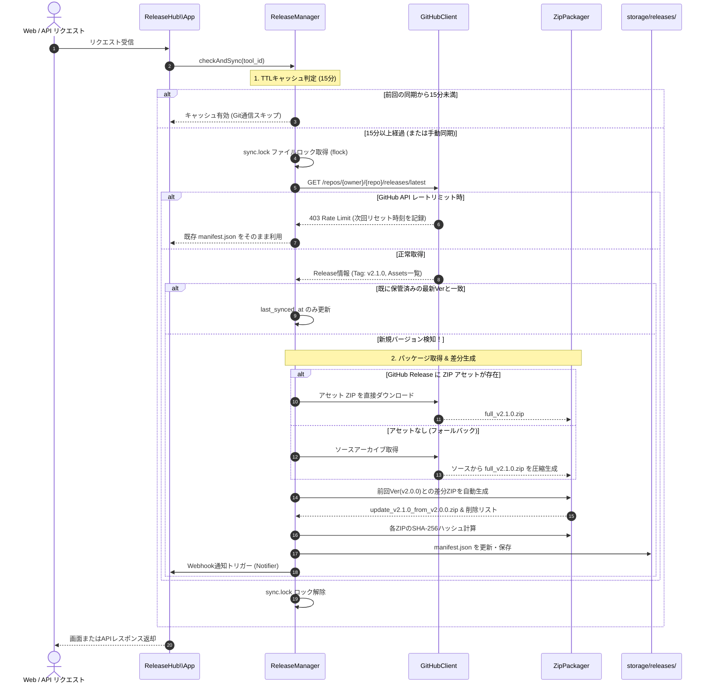

# ソフトウェア更新・フルパッケージ管理システム（ReleaseHub） 基本設計書

- **文書バージョン**: 1.0.0
- **作成日**: 2026-08-19
- **ステータス**: 基本設計完了 / ユーザーレビュー待ち
- **対応要件定義書**: [requirements.md](file:///d:/prog/PHP/ReleaseHub/doc/requirements.md)

---

## 1. システムアーキテクチャ & モジュール構成

### 1.1 全体構成図

```mermaid
flowchart TD
    subgraph Client [クライアント環境]
        Browser[Webブラウザ]
        UpdaterExe[アップデータ EXE]
    end

    subgraph Server [ReleaseHub サーバー (PHP 8.1+ / Apache)]
        subgraph PublicArea [Web公開領域 (server/public/)]
            Index[index.php\n(Webポータル)]
            Api[api.php\n(REST API)]
            Feed[feed.php\n(RSS / XML)]
            StaticAssets[assets/css, assets/js]
        end

        subgraph CoreArea [コアロジック (server/src/)]
            App[ReleaseHub\\App]
            ConfigLoader[ReleaseHub\\Config\\ConfigLoader]
            GitSync[ReleaseHub\\Git\\GitHubClient]
            ReleaseMgr[ReleaseHub\\Package\\ReleaseManager]
            DiffPackager[ReleaseHub\\Package\\ZipPackager]
            LogEngine[ReleaseHub\\Log\\LogEngine]
            GeoIPResolver[ReleaseHub\\Log\\GeoIPResolver]
            Notifier[ReleaseHub\\Notifier\\WebhookNotifier]
            FeedGenerator[ReleaseHub\\Notifier\\FeedGenerator]
            TemplateEngine[ReleaseHub\\Template\\MarkdownRenderer]
        end

        subgraph StorageArea [ストレージ領域 (server/storage/)]
            Releases[(releases/<tool_id>/\nmanifest.json & ZIP)]
            Logs[(logs/\ndownload_logs_YYYY-MM-DD.jsonl)]
            Locks[(locks/\nsync.lock)]
        end

        subgraph ConfigArea [設定領域 (server/config/)]
            BranchesJson[branches.json]
            WebhooksJson[webhooks.json]
            GeoipJson[geoip.json]
        end

        subgraph TemplateArea [テンプレート (server/templates/)]
            LayoutMd[layout.md]
            PagesMd[pages/*.md]
            ComponentsMd[components/*.md]
        end
    end

    %% Webアクセス
    Browser -->|HTTP GET| Index
    Index --> App
    App --> TemplateEngine
    TemplateEngine --> TemplateArea
    TemplateEngine --> LogEngine

    %% APIアクセス
    UpdaterExe -->|HTTP GET| Api
    Api --> App
    App --> ReleaseMgr
    App --> LogEngine

    %% フィード
    Browser & UpdaterExe -->|HTTP GET| Feed
    Feed --> App
    App --> FeedGenerator

    %% コア連携
    App --> ConfigLoader
    ConfigLoader --> ConfigArea
    App --> GitSync
    GitSync -.->|GitHub Releases API / ZIP| Releases
    ReleaseMgr --> DiffPackager
    DiffPackager --> Releases
    LogEngine --> GeoIPResolver
    LogEngine --> Logs
    App --> Notifier
    Notifier --> WebhooksJson
```

---

### 1.2 名前空間・クラス責務一覧 (`server/src/`)

PHP 8.1 の標準機能および PSR-4 オートローディングに準拠します（名前空間ルート: `ReleaseHub\`）。

| クラス名 | ファイルパス | 主な責務 |
| :--- | :--- | :--- |
| `ReleaseHub\App` | `src/App.php` | アプリケーション全体の初期化、DI（設定・ストレージパス注入）、ルーティング仲介 |
| `ReleaseHub\Config\ConfigLoader` | `src/Config/ConfigLoader.php` | `branches.json`, `webhooks.json`, `geoip.json` の安全な読み込み・バリデーション |
| `ReleaseHub\Git\GitHubClient` | `src/Git/GitHubClient.php` | GitHub REST API（Releases, Tags, Commits）との通信、レートリミット監視・キャッシュ制御 |
| `ReleaseHub\Package\ReleaseManager` | `src/Package/ReleaseManager.php` | リリース同期の統括（TTL判定、`flock` 排他制御、manifest更新、アセット取得・差分生成指示） |
| `ReleaseHub\Package\ZipPackager` | `src/Package/ZipPackager.php` | ZIPアセットダウンロード、前回Verとの差分ファイル抽出・差分ZIP圧縮生成、SHA256計算 |
| `ReleaseHub\Log\LogEngine` | `src/Log/LogEngine.php` | 日別ログ書き込み（フェイルセーフ）、逆引きホスト名取得、集計（累計/月間/週間/国別ランキング） |
| `ReleaseHub\Log\GeoIPResolver` | `src/Log/GeoIPResolver.php` | `config/geoip.json` に基づくオフラインIPレンジ判定（外部API非依存・高速国名特定） |
| `ReleaseHub\Template\MarkdownRenderer` | `src/Template/MarkdownRenderer.php` | パーツ別MD（`templates/`）の読み込み、プレースホルダー置換、HTMLへの安全な変換・レイアウト結合 |
| `ReleaseHub\Notifier\WebhookNotifier` | `src/Notifier/WebhookNotifier.php` | Discord / Slack へのリリース通知送信（非同期/タイムアウト制御付き cURL） |
| `ReleaseHub\Notifier\FeedGenerator` | `src/Notifier/FeedGenerator.php` | RSS 2.0 フィードおよび WinSparkle 用 XML / Appcast の生成 |

---

## 2. 画面設計（Webポータル & パーツ別MD/CSS & 相対ルーティング）

### 2.1 ポータブルな相対ルーティング設計
ドキュメントルート（`/`）に依存せず、任意のサブディレクトリ（例: `http://example.com/releasehub/`）で完全動作するよう、URLパラメータベースのルーティングを採用します。

| ページ名 | URLパラメータ | 説明 | 読み込むMDテンプレート |
| :--- | :--- | :--- | :--- |
| **ツール一覧 & ランキング** | `index.php` または `?page=tools` | 全ツール一覧、人気ランキングTOP10、国別統計、検索 | `pages/tools.md` |
| **ツール詳細 & リリース履歴** | `?page=tool&id={tool_id}` | 特定ツールの詳細、バージョン一覧、DLリンク、手動同期 | `pages/tool_detail.md` |
| **最近のリリース** | `?page=recent` | 直近で更新されたツールの時系列リスト | `pages/recent.md` |
| **リリース全体年表** | `?page=releases` | 全ツール横断の全バージョン履歴タイムライン | `pages/releases.md` |
| **手動同期トリガー** | `?page=tool&id={tool_id}&action=sync` | 指定ツールのGitHub最新リリースを手動再取得 | （同期後、詳細画面へリダイレクト） |

※CSS・JS・アイコン等の静的アセットは `./assets/css/...` のように相対パスで参照します。

---

### 2.2 パーツ別 Markdown (md) テンプレート & プレースホルダー設計

画面全体を `templates/layout.md`（共通枠）で囲み、内部に各ページテンプレートおよびUIパーツ（コンポーネント）を埋め込みます。

#### 1. テンプレートファイル配置 (`server/templates/`)
```
server/templates/
├── layout.md                     # 共通ヘッダー・グローバルナビ・フッター枠
├── pages/
│   ├── tools.md                  # ツール一覧・ランキング画面
│   ├── tool_detail.md            # ツール詳細・バージョン履歴画面
│   ├── recent.md                 # 最近のリリース画面
│   └── releases.md               # リリース全体年表画面
└── components/
    ├── ranking_card.md           # 人気ランキング表示枠
    ├── tool_card.md              # ツール一覧用のカードパーツ
    ├── release_item.md           # バージョン履歴テーブル/カードパーツ
    ├── country_stats.md          # 国別アクセス統計リストパーツ
    └── nav.md                    # グローバルナビゲーションパーツ
```

#### 2. 定義済みプレースホルダー一覧
| プレースホルダー | 置換内容 | 適用パーツ・ページ |
| :--- | :--- | :--- |
| `{PAGE_TITLE}` | ページタイトル | `layout.md` |
| `{BASE_URL}` | 現在の設置ディレクトリへの相対ベースURL (`.`) | `layout.md`, 全体 |
| `{GLOBAL_NAV}` | ナビゲーションHTML | `layout.md` |
| `{CONTENT}` | メインコンテンツHTML | `layout.md` |
| `{TOOL_ID}` | ツール識別子 (例: `TrustChain`) | `tool_card.md`, `tool_detail.md` |
| `{TOOL_NAME}` | ツール表示名 | `tool_card.md`, `tool_detail.md` |
| `{TOOL_DESC}` | ツール概要説明文 | `tool_card.md`, `tool_detail.md` |
| `{LATEST_VERSION}` | 最新バージョン (例: `v2.1.0`) | `tool_card.md`, `ranking_card.md` |
| `{TOTAL_DOWNLOADS}` | 累計ダウンロード数 (例: `1,250`) | `tool_card.md`, `ranking_card.md` |
| `{RELEASE_DATE}` | リリース日時 (例: `2026-08-19 09:00`) | `release_item.md` |
| `{RELEASE_NOTES_HTML}`| リリースノート (MarkdownをHTML変換) | `release_item.md` |
| `{FULL_ZIP_URL}` | フルZIPダウンロードURL | `release_item.md` |
| `{UPDATE_ZIP_URL}` | 差分ZIPダウンロードURL | `release_item.md` |
| `{SHA256_FULL}` | フルZIPのSHA256ハッシュ | `release_item.md` |
| `{SHA256_UPDATE}` | 差分ZIPのSHA256ハッシュ | `release_item.md` |
| `{RANK_NUMBER}` | ランキング順位 (例: `1`, `2`) | `ranking_card.md` |
| `{COUNTRY_NAME}` | 国名 (例: `Japan`) | `country_stats.md` |
| `{COUNTRY_COUNT}` | 国別ダウンロード数 | `country_stats.md` |

---

### 2.3 パーツ別 CSS 設計 (`server/public/assets/css/`)
各UIパーツごとに対応するCSSファイルを分離し、保守性とデザインの自由度を高めます。

```
server/public/assets/css/
├── common.css                    # リセット、基本フォント、グリッド、カラートークン
└── components/
    ├── nav.css                   # ヘッダー・ナビゲーションバー
    ├── ranking.css               # ランキングブロック・バッジ
    ├── tool_card.css             # ツールカード・検索ボックス
    ├── release_table.css         # バージョン履歴一覧・ダウンロードボタン・ハッシュ表示
    └── country_stats.css         # 国別統計プログレスバー
```

---

## 3. API仕様書（アップデータEXE連携 & フィード）

### 3.1 バージョン確認 API (`api.php?action=check`)
アップデータEXEが起動時または更新確認時に呼び出すエンドポイント。

- **HTTP Method**: `GET`
- **URL**: `api.php?action=check&tool={tool_id}&current={current_version}`
- **リクエストパラメータ**:
  | パラメータ | 型 | 必須 | 説明 | 例 |
  | :--- | :--- | :--- | :--- | :--- |
  | `action` | string | ○ | 固定値 `check` | `check` |
  | `tool` | string | ○ | ツールID | `TrustChain` |
  | `current` | string | ○ | クライアントの現在バージョン | `v2.0.0` |

- **レスポンス (JSON / HTTP 200 OK)**:
  ```json
  {
    "status": "success",
    "tool_id": "TrustChain",
    "current_version": "v2.0.0",
    "latest_version": "v2.1.0",
    "has_update": true,
    "release_date": "2026-08-19T09:00:00+09:00",
    "release_notes": "・ライセンス認証の安定性向上\n・軽微な不具合修正",
    "packages": {
      "update": {
        "available": true,
        "filename": "TrustChain_v2.1.0_update_from_v2.0.0.zip",
        "url": "api.php?action=download&tool=TrustChain&version=v2.1.0&type=update",
        "size": 425100,
        "sha256": "8f12c...",
        "deleted_files": []
      },
      "full": {
        "available": true,
        "filename": "TrustChain_v2.1.0_full.zip",
        "url": "api.php?action=download&tool=TrustChain&version=v2.1.0&type=full",
        "size": 15423800,
        "sha256": "3a7bd..."
      }
    }
  }
  ```

---

### 3.2 パッケージダウンロード API (`api.php?action=download`)
指定されたZIPファイルをストリーム返却し、バックグラウンドでダウンロードログを記録します。

- **HTTP Method**: `GET`
- **URL**: `api.php?action=download&tool={tool_id}&version={version}&type={type}`
- **リクエストパラメータ**:
  | パラメータ | 型 | 必須 | 説明 | 例 |
  | :--- | :--- | :--- | :--- | :--- |
  | `action` | string | ○ | 固定値 `download` | `download` |
  | `tool` | string | ○ | ツールID | `TrustChain` |
  | `version` | string | ○ | 対象バージョン | `v2.1.0` |
  | `type` | string | ○ | パッケージ種別 (`full` または `update`) | `update` |

- **レスポンスヘッダ**:
  ```http
  HTTP/1.1 200 OK
  Content-Type: application/zip
  Content-Disposition: attachment; filename="TrustChain_v2.1.0_update_from_v2.0.0.zip"
  Content-Length: 425100
  Cache-Control: public, max-age=86400
  ```
- **ストリーム処理**: `readfile()` または 1MB 単位のチャンクストリーム出力を行い、メモリを消費せずに送信。送信完了時にダウンロードログを保存。

---

### 3.3 フィード配信 API (`feed.php`)
- **RSS 2.0**: `feed.php?type=rss[&tool={tool_id}]` (`Content-Type: application/rss+xml; charset=utf-8`)
- **XML / Appcast**: `feed.php?type=xml[&tool={tool_id}]` (`Content-Type: application/xml; charset=utf-8`)

---

## 4. データ構造 & ファイル設計

### 4.1 監視対象ツール定義 (`server/config/branches.json`)
```json
{
  "tools": [
    {
      "id": "TrustChain",
      "name": "TrustChain",
      "description": "C++アプリ向けビルド出自証明＆オンラインライセンス認証モジュール",
      "repository": "https://github.com/BLUE000/TrustChain.git",
      "branch": "master",
      "exclude": [".git", ".github", ".gitignore", "tests"],
      "webhook_url": "https://discord.com/api/webhooks/..."
    }
  ]
}
```

### 4.2 リリース管理メタデータ (`server/storage/releases/<tool_id>/manifest.json`)
```json
{
  "tool_id": "TrustChain",
  "tool_name": "TrustChain",
  "latest_version": "v2.1.0",
  "total_downloads": 1250,
  "last_synced_at": "2026-08-19T18:00:00+09:00",
  "releases": [
    {
      "version": "v2.1.0",
      "prev_version": "v2.0.0",
      "release_date": "2026-08-19T09:00:00+09:00",
      "commit_hash": "e6f1d1e...",
      "release_notes": "開発ブランチでの改ざん検知対応の改善",
      "full_package": {
        "filename": "TrustChain_v2.1.0_full.zip",
        "size": 15423800,
        "sha256": "3a7bd...",
        "downloads": 820
      },
      "update_package": {
        "filename": "TrustChain_v2.1.0_update_from_v2.0.0.zip",
        "size": 425100,
        "sha256": "8f12c...",
        "downloads": 430,
        "deleted_files": []
      }
    }
  ]
}
```

### 4.3 日別ダウンロードログ (`server/storage/logs/download_logs_YYYY-MM-DD.jsonl`)
1行に1JSONオブジェクトを追記（JSON Lines形式）：
```json
{"timestamp":"2026-08-19T09:50:00+09:00","tool_id":"TrustChain","version":"v2.1.0","package_type":"update","ip_address":"123.45.67.89","host_name":"client.example.isp.ne.jp","country_code":"JP","country_name":"Japan","user_agent":"ReleaseHubUpdater/1.0","client_type":"updater_exe"}
```

### 4.4 オフラインGeoIPマッピングテーブル (`server/config/geoip.json`)
主要なCIDRブロック / IP範囲と国コード（JP, US, GB, etc.）のマッピングリストを保持し、高速二分探索で国名を判定。

---

## 5. リリース同期 & 差分生成ロジック詳細



---

## 6. 自動テスト設計（全ルート網羅 & サマリ出力）

### 6.1 テスト構成 (`tests/`)
- `tests/bootstrap.php`: テスト用パラメータ初期化（`tests/fixtures/branches.json`, `tests/temp_storage/` をDI注入）
- `tests/run.php`: CLIテスト一括実行スクリプト（全ルート検証・サマリ出力・ログ保存）
- `tests/logs/`: テスト実行ログ保管領域（`test_YYYY-MM-DD_HH-MM-SS.log`）

### 6.2 検証ルート（全テスト項目一覧）

| # | テスト項目 | 種別 | 検証内容 | 期待結果 |
| :-: | :--- | :--- | :--- | :--- |
| **01** | `ConfigLoaderTest` | 単体 | `branches.json` の不正構文・必須キー欠落チェック | 例外が安全に捕捉されデフォルト値/エラーが返る |
| **02** | `GeoIPResolverTest` | 単体 | 日本/海外/ローカルIPからの国名特定テスト | `123.45.67.89` ➔ `JP/Japan` が正しく返る |
| **03** | `LogEngineTest` | 単体 | 日別ログ書き込み・フェイルセーフ・集計テスト | 日別ファイルが生成され、ランキング集計が一致する |
| **04** | `MarkdownRendererTest` | 単体 | プレースホルダー置換・HTMLパーステスト | `{TOOL_NAME}` 等が正確に置換・描画される |
| **05** | `ZipPackagerTest` | 単体 | 差分抽出・差分ZIP圧縮・SHA256計算テスト | 変更ファイルのみが含まれ、ハッシュ値が一致する |
| **06** | `ApiCheckRouteTest` | 結合 | `api.php?action=check` のレスポンス検証 | 最新Ver情報、has_update判定が正常なJSONで返る |
| **07** | `ApiDownloadRouteTest` | 結合 | `api.php?action=download` のストリーム配信 | 正しいZIPバイナリが返り、DLログが追記される |
| **08** | `WebPortalToolsRouteTest` | 結合 | `index.php?page=tools` の一覧画面HTML検証 | ツール一覧・ランキング・検索UIが正常描画される |
| **09** | `WebPortalDetailRouteTest`| 結合 | `index.php?page=tool&id=TrustChain` の詳細画面 | バージョン履歴・ダウンロードボタンが正常描画される |
| **10** | `FeedRssRouteTest` | 結合 | `feed.php?type=rss` のRSS 2.0構文検証 | 有効なXML/RSS 2.0が出力される |
| **11** | `FeedXmlRouteTest` | 結合 | `feed.php?type=xml` のAppcast XML構文検証 | WinSparkle互換のAppcast XMLが出力される |
| **12** | `RateLimitFallbackTest` | 結合 | GitHub APIレートリミット到達時のフォールバック | 既存manifestが維持され、サービスが継続する |
| **13** | `ConcurrencyLockTest` | 結合 | 同時アクセス時の `sync.lock` 排他制御テスト | 二重生成が防止され、片方が安全に待機/完了する |

---

### 6.3 テストサマリ出力仕様 (`tests/run.php`)

CLI実行時に全テスト完了後、以下のフォーマットで標準出力および `tests/logs/test_YYYY-MM-DD_HH-MM-SS.log` に出力します。

```text
============================================================
 ReleaseHub Automated Test Suite Summary
============================================================
 実行日時: 2026-08-19 18:20:00
 実行件数: 13 件 (OK: 13 件 / NG: 0 件)
 総合結果: ALL PASSED (合格)
 NGテスト項目番号: なし
 テスト実行時間: 0.42 秒
 ログファイル: tests/logs/test_2026-08-19_18-20-00.log
============================================================
```
