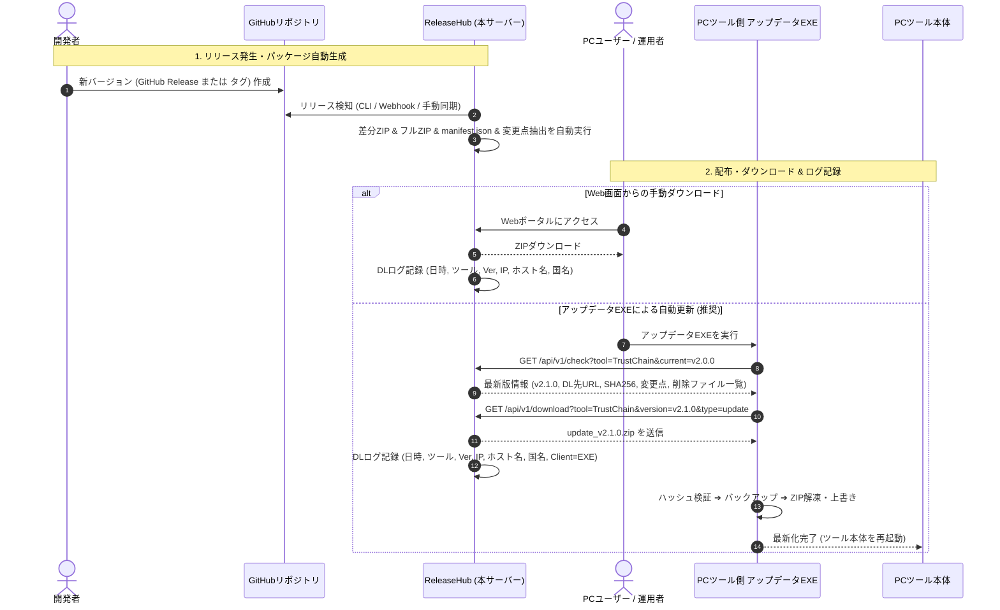

# ソフトウェア更新・フルパッケージ管理システム（ReleaseHub） 要件定義書

## 1. プロジェクト概要
- **システム名**: ReleaseHub（PCツール向け更新・フルパッケージ管理システム）
- **本システム Git リポジトリ**: `https://github.com/BLUE000/ReleaseHub.git`
- **本システム デフォルトブランチ**: `master`

### 1.1 目的・背景
PC上で動作する複数のクライアントツール（デスクトップアプリ/CLIツール等）において、バージョンアップ時の**「手動でZIPファイルをダウンロードして手作業で解凍・配置する」という手間を解消**することを目的とします。

本システム（ReleaseHub）は、各ツールのGitリポジトリ（GitHub Releases / タグ）を監視・管理し、リリース時に自動でアップデート用差分ZIPおよびフルインストールZIPを生成・保管します。また、PCツール側の「アップデート用EXE」と連携した自動最新化、Web画面からの手動ダウンロード、ダウンロード履歴の詳細ログ解析（国・ホスト名特定）、およびTOPページでのダウンロードランキング表示を提供します。

### 1.2 本要件定義のスコープ範囲 & スコープ外事項
- **本フェーズの対象スコープ (In Scope)**:
  - ReleaseHub コアシステム（PHP Webポータル、REST API、配信・リリース生成エンジン、日別ログ記録・集計）
  - パブリック（公開）GitHubリポジトリの監視・アセットZIP取得・差分生成
  - オフライン/ローカルIP判定テーブルによる国名・ホスト名特定
- **スコープ外・次期検討事項 (Out of Scope)**:
  - プライベートリポジトリの認証トークン管理（現段階ではパブリックリポジトリを前提とし、必要に応じ将来拡張）
  - クライアント側アップデータ（EXE）の詳細内部実装（API連携仕様のみを本定義の対象とし、EXE自体は別途検討）
  - プロキシ/VPN経由の高度なネットワーク偽装検知、「確認くん」「診断くん」レベルの詳細環境解析機能

---

## 2. システム全体像 & アーキテクチャ

```mermaid
flowchart TD
    subgraph GitEnv [開発・Git環境]
        Repos[(監視対象ツールのGitリポジトリ\nGitHub Releases / タグ)]
    end

    subgraph ReleaseHubServer [ReleaseHub (本システム / サーバー環境)]
        Config[監視対象ブランチ定義\nconfig/branches.json]
        ReleaseEngine[リリース生成エンジン\n(差分/フルZIP & 変更点生成)]
        LogEngine[ダウンロードログ・解析エンジン\n(ホスト名・国特定 & ランキング集計)]
        Storage[(パッケージ・ログ保管庫\n/storage/)]
        
        WebPortal[Web管理 & ポータル画面\n(一覧 / 最近 / 全体 / ランキング)]
        UpdateAPI[アップデート配信 API\n/api/check, /api/download]
    end

    subgraph ClientPC [PC環境 (ユーザー端末)]
        ToolApp[PCツール本体]
        UpdaterExe[アップデート用 EXE\n(各ツールに付属)]
    end

    %% リリース生成フロー
    Repos -->|① リリース検知 / 取得| ReleaseEngine
    Config --> ReleaseEngine
    ReleaseEngine -->|② ZIP & manifest 生成| Storage
    Storage --> WebPortal
    Storage --> UpdateAPI

    %% 手動ダウンロード
    WebPortal -.->|ブラウザから手動DL (最新/旧Ver)| ClientPC
    WebPortal -->|DLログ記録| LogEngine

    %% 自動アップデート (EXE連携)
    ToolApp -->|起動 / 更新チェック| UpdaterExe
    UpdaterExe -->|③ 最新Ver問い合わせ| UpdateAPI
    UpdateAPI -->|④ manifest(URL, SHA256等)| UpdaterExe
    UpdaterExe -->|⑤ ZIP自動取得| UpdateAPI
    UpdateAPI -->|DLログ記録| LogEngine
    UpdaterExe -->|⑥ 最新化完了| ToolApp

    %% ログ集計
    LogEngine --> Storage
    Storage -->|ランキング・統計データ| WebPortal
```

---

## 3. シーケンス（リリースからPCツールの自動最新化・ログ記録まで）



---

## 4. 機能要件

### 4.1 監視対象リポジトリ・ブランチ管理（設定ファイル駆動）
- **明示的な設定ファイル管理**:
  - リポジトリの自動検出・全自動クロールは行わず、JSON設定ファイル（`config/branches.json`）に明示的に登録されたツールのみを監視・管理対象とする。
  - ツール追加・ブランチ変更時は、設定ファイルを更新（またはファイル配置）することで安全かつ確実に反映。
- ツールID、表示名、GitリポジトリURL、対象ブランチ、除外ファイル設定（`.git`, テスト等）を保持。
- GitHub Releases（アセットZIP）および Gitタグ/ブランチからのソースアーカイブの双方に対応。

### 4.2 リリース生成 & 変更点（リリースノート）自動抽出
1. **パッケージ（ZIP）取得・生成ロジック**:
   - **フルインストール用ファイル（全体ZIP）**:
     - **第一優先（通常運用）**: **GitHub Release にアタッチされた ZIP ファイル（Release Assets）を直接ダウンロード・保管**。サーバー側での圧縮作業は発生せず、ネットワーク取得のみで高速に処理。
     - **フォールバック（アタッチされていない場合のみ）**: サーバー側で Git ソースツリー/タグから全体 ZIP の**圧縮生成作業を実行**して保管。
   - **アップデート用ファイル（差分ZIP）**:
     - Release アセットにアップデート専用 ZIP（`*_update*.zip` 等）がアタッチされている場合はそれを直接取得。
     - **アタッチされていない場合**: サーバー側で前回バージョンと今回バージョンの追加・変更ファイルを抽出し、差分 ZIP の**圧縮生成作業を実行**（および削除リスト `delete_list.json` 生成）。
   - **整合性ハッシュ計算**: 各ZIPの SHA-256 ハッシュ値を自動算出して manifest.json に記録（改ざん防止・クライアント検証用）。
2. **変更点（リリースノート）抽出ロジック**:
   - **第一優先**: GitHub Release の本文（Markdown説明文）を取得。
   - **フォールバック**: Release本文が空の場合、前回タグからの `git log`（コミットメッセージ一覧）から自動生成。

### 4.3 Web管理 & ポータル画面（UI構成 & パーツ別MD・CSS & ルーティング）

1. **ポータブルなURL・ルーティング設計（サブディレクトリ配置対応）**:
   - Webサーバーのドキュメントルート直下だけでなく、任意のサブディレクトリ（例: `/releasehub/`, `/tools/` 等）への配置に対応。
   - ルート絶対パス（`/` 始まり）に依存せず、**相対パスベース（`./` または `?page=...` や自動ベースパス検出）**でページ遷移・静的アセット読み込み・API呼び出しを完結させる。ドキュメントルートへ意図せず戻るようなリンクは使用しない。

2. **パーツ別 Markdown (md) テンプレート & パーツ別 CSS 構成**:
   - 画面の骨格・各UIコンポーネントを **パーツ単位の Markdown (`.md`) ファイル** として管理（`server/templates/components/` および `server/templates/pages/`）。
   - **プレースホルダー記法**:
     - パーツごとに動的データ埋め込み記法を定義（例: `{ToolName}`, `{version}`, `{release_date}`, `{total_downloads}`, `{release_notes}` 等）。
     - リスト表示（ツール一覧、バージョン履歴等）もパーツテンプレートを繰り返し展開する構造。
   - **パーツ別 CSS（モジュールCSS）**:
     - 各パーツ（ヘッダー、ツールカード、ランキングブロック、バージョン一覧テーブル等）に対応するスタイルシートをセットで用意し、デザイン変更や粒度調整を容易にする。

3. **画面構成・メニュー**:
   - **ツール/システム一覧 (`?page=tools` または デフォルト)**:
     - リリース物としてGitから取得した全ツール・システムの一覧表示。
     - ツール名、概要、最新バージョン、最終更新日、総ダウンロード数を表示。
     - **人気ツールダウンロードランキング**: TOPページ上部に人気ツールランキング（TOP 5/10）を表示。
     - **国別アクセス統計**: どの国・地域から多くダウンロードされているかの分布サマリー。
     - ツール名によるリアルタイム検索窓。
   - **ツール詳細 & リリース一覧 (`?page=tool&id={tool_id}`)**:
     - ツール概要、リポジトリリンク、**TOTALダウンロード数（累計）**を表示。
     - **バージョン別人気ランキング**: ツール内でどのバージョンが多く利用されているかを表示。
     - 「Gitから最新リリースを再取得」ボタン（手動同期）。
     - バージョンごとのリリース履歴一覧（変更点、フルDL数、差分DL数、ダウンロードリンク、SHA256ハッシュ）。
   - **最近のリリース (`?page=recent`)**:
     - 直近でリリースのあったツールの一覧（時系列順）。
     - ツール名リンク、最新バージョン、リリース日、変更点サマリーを表示。
   - **リリース全体 (`?page=releases`)**:
     - 全ツール横断の全リリース年表（タイムライン）。いつ・どのツールが更新されたかを一覧表示。

### 4.4 ダウンロードログ記録 & アクセス解析（日別ローテーション & ローカルGeoIP判定）
ダウンロード発生時にバックグラウンドで詳細ログを記録・集計：
- **記録項目**:
  - ダウンロード日時（年・月・日・時・分・秒）
  - ツールID、ツール名、ダウンロードバージョン
  - パッケージ種別（フル / アップデート差分）
  - IPアドレス、**ホスト名**（`gethostbyaddr` 逆引き）
  - **国コード・国名**:
    - 外部Web APIへの問い合わせは行わず、**ローカル判定テーブル（`config/geoip.json` 等のオフラインIPレンジDB）** を用いて高速かつ安定して特定。
    - ※プロキシ・VPN等の偽装判定や「確認くん」レベルの高度な環境解析は行わず、接続元IPに基づく判定とする。
  - User-Agent、クライアント種別（Webブラウザ / アップデータEXE）
- **日別ファイル分割（ログ肥大化防止）**:
  - `storage/logs/download_logs_YYYY-MM-DD.jsonl` として日単位でファイルを分割保存。
  - 集計処理時は必要な期間（当日/当月/全期間）のログファイルのみを走査・キャッシュし、パフォーマンスを維持。
- **集計・活用**:
  - ツール別累計ダウンロード数、バージョン別ダウンロード数、期間別（全期間/月間/週間）ランキングの自動算出。

### 4.5 アップデート配信 API（アップデータEXE用エンドポイント）
1. **バージョン確認 API** (`GET /api/v1/check`):
   - クエリ: `tool_id`, `current_version`
   - レスポンス: 最新バージョン、更新要否、リリースノート、ZIPのダウンロードURL、SHA256ハッシュ、削除対象ファイル一覧。
2. **ダウンロード API** (`GET /api/v1/download`):
   - 指定されたバージョン・種類のZIPをストリーム返却（DLログを自動記録）。

### 4.6 外部連携 & 更新通知機能 (RSS / XML / WebHook)
新バージョンリリース時に、外部システムやユーザーへ即座に更新情報を周知・連携する仕組みを提供します。

1. **RSS 2.0 フィード配信**:
   - **全体フィード (`GET /feed.php?type=rss` または `/rss.xml`)**: 全ツールの最新リリース履歴まとめ。
   - **ツール個別フィード (`GET /feed.php?type=rss&tool={tool_id}`)**: 特定ツールのリリース履歴限定。
2. **XML / Appcast 配信**:
   - **全体XML (`GET /feed.php?type=xml`)**: 全ツールの最新バージョン一覧。
   - **ツール個別Appcast (`GET /feed.php?type=xml&tool={tool_id}`)**: WinSparkle等の自動更新ライブラリ向け。
3. **アウトゴーイング WebHook 送信 (Discord / Slack 等)**:
   - **暫定通知項目 (JSONペイロード)**:
     - ツール名 (`tool_name`)
     - 最新バージョン (`version`)
     - リリース日時 (`release_date`)
     - 変更点・リリースノート要約 (`release_notes`)
     - ダウンロードURL (`download_url`)
   - 共通チャンネル向け全体通知およびツール個別Webhookの双方に対応（将来的な通知項目拡張が容易な構造）。

### 4.7 多言語README自動取得・モーダル表示要件
多言語対応されたツールのドキュメントをユーザーが自身の得意言語で手軽に閲覧できるようにするため、以下の機能を備える。

1. **多言語READMEの自動検知・取得 ＆ キャッシュ**:
   - 各リポジトリのルートに存在する多言語READMEファイル（`README.md`, `README.ja.md`, `README.en.md`, `README.de.md`, `README.fr.md`, `README.pt.md`, `README.ru.md` 等）をGitHub API経由で自動検知して取得し、ストレージ（`storage/readmes/{tool_id}/`）にキャッシュ保管する。
   - 存在する言語ファイルのみを動的に抽出してメタデータとして管理する。
2. **ページ内モーダル（ダイアログ）による閲覧UI**:
   - ツール詳細画面（ダウンロードページ）のヘッダーに「📖 ドキュメント・README」ボタンを配置。
   - クリック時、ブラウザの広告ブロッカー（AdGuard, uBlock等）やポップアップブロックに一切影響されないページ内DOMモーダルウィンドウを展開。
   - **モーダル上部**: リポジトリに存在する言語のみを選択できる「言語切り替えプルダウン（またはタブ）」（例: `🇯🇵 日本語 (README.ja.md)`, `🇺🇸 English (README.md)` 等）を配置。
   - **モーダル本文**: 選択された言語のMarkdownをHTMLとして美しくレンダリングし、内部スクロール可能とする。
   - **別タブ閲覧リンク**: モーダル右上に「別タブで開く ↗」リンク（`?page=readme&tool={tool_id}&lang={lang}`）を設け、作業用画面として別ウィンドウで保持可能とする。

### 4.8 リリースノート空時ハンドリング ＆ ドキュメント連携要件
1. **リリースノート未記載時のフォールバック表示**:
   - GitHub Releasesの本文（`body`）が空欄、未入力の場合、「*リリースノートは記載されていません。*」と明示的に表示する。
   - GitHub側でリリースノートが追記・修正された場合は、次回の同期時に自動的に最新内容へ更新する。
2. **リリースノート内のREADMEリンク自動変換**:
   - リリースノート本文中に `README.md`, `README.ja.md`, `README` などの単語が含まれる場合、クリックすると該当言語のREADMEモーダルを開くリンクへ自動変換する。

### 4.9 自動テスト & テスト環境分離要件
本システムは継続的な機能追加やリファクタリングを安全に行うため、自動テスト（単体テスト・結合テスト・E2Eテスト）が容易に実行できる設計とします。

1. **テスト環境と本番環境の完全分離**:
   - テスト専用ディレクトリ（`tests/`）を配置し、本番デプロイ対象（`server/`）から完全に切り離す。
   - テスト実行時はテスト用パラメータ初期化ファイル（`tests/bootstrap.php`）を経由してテスト用設定（モックデータ、テスト用ストレージ `tests/temp_storage/` 等）を注入し、本番データ・ログ（`server/storage/`）を一切汚染しない。
2. **コアロジックの再利用（テスト専用分岐の排除）**:
   - 本番用（`server/public/index.php`）とテスト用で同一のコアクラス・モジュールを呼び出す。
   - 設定ファイルパスやストレージパスを外部から引数/DIで注入可能とし、本番コード内にテスト専用の不要な条件分岐を埋め込まない。
3. **全ルート網羅テスト & デグレ（回帰）チェックの必須実施**:
   - **全ルート確認**: Webポータルの各ページ（一覧、詳細、最近、年表、README）、API（check, download, sync, readme）、フィード（RSS, XML）、リリース同期・ZIP生成、ログ記録など、全実行ルート・エンドポイントを網羅して検証。
   - **デグレチェック必須**: コードの追加・変更・リファクタリング時は、必ず全テストスイートを一括実行（`php tests/run.php` 等）し、既存機能にデグレ（先祖返り・破損）が発生していないことを毎回確認。
4. **CLI一括実行・結果ログ全量 & サマリ出力仕様**:
   - テストはCLIスクリプト（`php tests/run.php`）で一括実行。
   - 実行中は標準出力を逐次追うのではなく、テスト完了まで待機して**「結果サマリ」**を確認。
   - **サマリ出力フォーマット**:
     ```text
     ========================================
     テスト実行サマリ
     ========================================
     実行件数: XXX件 (OK: XX件 / NG: XX件)
     NGテスト項目番号: なし (または #3, #7 等)
     テスト実行時間: X.XX秒
     ========================================
     ```
   - **テストログ保管（Git管理外）**:
     - テスト専用ログディレクトリ（`tests/logs/`）に、実行ごとの詳細ログ（`test_YYYY-MM-DD_HH-MM-SS.log`）およびサマリを自動保存（統計的な実行時間の推測・ボトルネック把握に活用）。
     - `tests/logs/` は `.gitignore` に指定し、Git管理対象外とする。

### 4.10 セキュリティ & 運用管理方針（リードオンリー型Webポータル ＆ 管理者同期）
1. **Web管理画面での編集・アップロード機能の完全排除**:
   - Web画面上でのツールの追加・編集・設定変更等の管理機能は一切持たせない。
   - 管理者による設定変更やファイル追加は、**SFTPまたはサーバー直接配置（`config/branches.json` やテンプレートMD/CSSの更新）**によって行う。
2. **高い堅牢性とゼロアタックサーフェス**:
   - 管理者ログイン認証やセッション管理が不要となり、認証突破、CSRF、ファイルアップロード脆弱性などのWebセキュリティリスクを根本から排除。
   - Webポータルは「閲覧・ダウンロード・READMEモーダル閲覧・API配信」に特化した堅牢なシステムとする。
3. **管理者ローカル定期実行同期API (action=sync)**:
   - `api.php?action=sync&token=...` による管理者専用同期エンドポイントを提供。
   - 前回の同期から変化がない場合は安全にスキップ（`has_changes: false`）し、ログを残して静かに終了可能とする。

### 4.11 非機能要件・パフォーマンス & 異常系フォールバック仕様

1. **サーバー動作環境・制約**:
   - **PHPバージョン**: PHP 8.1 以上（さくらインターネット等のレンタルサーバー環境に完全適合）
   - **必須PHP拡張**: `OpenSSL`, `JSON`, `cURL`, `MBString`, `ZIP`
   - **リソース制約**: `memory_limit: 128MB`, `max_execution_time: 30秒` 前提での省メモリ・低負荷設計。
2. **Webアクセス時リリース同期 & 負荷・二重実行対策 (Stale-While-Revalidate)**:
   - **Cron不要の自動同期**: Webアクセス時に前回のGit確認時刻（TTL、例: 15分）をチェックし、有効期限切れの場合のみ軽量な最新情報チェックを実行。
   - **超高速レスポンス（キャッシュファースト）**: 通常アクセス時は保存済みの `manifest.json` を即座に返却（0.01秒表示）。ユーザーを待たせない。
   - **オンデマンド差分生成**: 新規バージョンが検出された場合のみ差分ZIPを新規生成・保管。既存バージョンのZIPは再生成せず再利用。
   - **ファイルロックによる二重実行防止**: 同期処理開始時に `storage/locks/sync.lock`（`flock` 排他ロック）を適用し、多重アクセス時の重複ビルドを防止。
3. **ストリーム配信（メモリ枯渇防止）**:
   - ZIPダウンロード配信時はファイル全体をPHPメモリに読み込まず、`readfile()` または チャンク分割ストリーム出力（1MB単位）を採用し、数十MB〜数百MBのファイルでも128MBメモリ制限内で安全に配信。
4. **異常系・フォールバック（障害耐性）**:
   - **GitHub API レートリミット時**: 制限到達時はサーバー内に保持している既存の `manifest.json` / ZIPをそのまま提供しWebポータルを継続運用。API制限解除時刻まで新規Git問い合わせを自動待機。
   - **ログ書き込み失敗時（ディスク満杯等）**: ログ保存エラーが発生しても例外をフェイルセーフで処理し、ユーザーへのZIPファイル配信自体は正常に完了させる。

---

## 5. データ構造定義

### 5.1 監視対象ツール定義 (`config/branches.json`)
```json
{
  "tools": [
    {
      "id": "TrustChain",
      "name": "TrustChain",
      "description": "C++アプリ向けビルド出自証明＆オンラインライセンス認証モジュール",
      "repository": "https://github.com/BLUE000/TrustChain.git",
      "branch": "master",
      "work_dir": "./repos/TrustChain",
      "exclude": [
        ".git",
        ".github",
        ".gitignore",
        "tests"
      ]
    }
  ]
}
```

### 5.2 ダウンロードログ構造 (`storage/logs/download_logs_YYYY-MM-DD.jsonl`)
```json
{
  "timestamp": "2026-08-19T09:50:00+09:00",
  "tool_id": "TrustChain",
  "version": "v2.1.0",
  "package_type": "update",
  "ip_address": "123.45.67.89",
  "host_name": "client.example.isp.ne.jp",
  "country_code": "JP",
  "country_name": "Japan",
  "user_agent": "ToolUpdater/1.0",
  "client_type": "updater_exe"
}
```

### 5.3 リリース管理メタデータ (`storage/releases/<tool_id>/manifest.json`)
```json
{
  "tool_id": "TrustChain",
  "tool_name": "TrustChain",
  "latest_version": "v2.1.0",
  "total_downloads": 1250,
  "releases": [
    {
      "version": "v2.1.0",
      "prev_version": "v2.0.0",
      "release_date": "2026-08-19T09:00:00+09:00",
      "commit_hash": "e6f1d1e...",
      "release_notes": "開発ブランチでの改ざん検知対応の改善\nGitHub API のレートリミット対策",
      "full_package": {
        "filename": "TrustChain_v2.1.0_full.zip",
        "size": 15423800,
        "sha256": "3a7bd...",
        "downloads": 820
      },
      "update_package": {
        "filename": "TrustChain_v2.1.0_update_from_v2.0.0.zip",
        "size": 425100,
        "sha256": "8f12c...",
        "downloads": 430,
        "deleted_files": []
      }
    }
  ]
}
```

---

## 6. ディレクトリ構成案

```
d:/prog/PHP/ReleaseHub/
├── DecisionLog/                # 意思決定ログ置き場
├── doc/                        # 要件定義・設計ドキュメント
│   └── requirements.md         # 要件定義書（本ドキュメント）
├── server/                     # コアシステム (PHP Web / API / リリース生成エンジン)
│   ├── bin/
│   │   └── release.php         # リリース生成・同期CLIコマンド
│   ├── config/
│   │   ├── branches.json       # 監視対象ツール・ブランチ設定
│   │   ├── webhooks.json       # Webhook送信先設定
│   │   └── geoip.json          # 簡易IP-国マッピング（またはGeoIP設定）
│   ├── public/                 # Web公開領域（WebUI & API & Feeds）
│   │   ├── assets/             # CSS, JS, アイコン等の静的アセット
│   │   │   ├── css/            # パーツ別・共通CSS
│   │   │   │   ├── common.css  # 基本レイアウト・タイポグラフィ
│   │   │   │   └── components/ # パーツ別スタイル
│   │   │   └── js/main.js
│   │   ├── index.php           # Webポータル（一覧 / 詳細 / 最近 / 全体 / ランキング）
│   │   ├── api.php             # アップデータEXE向け REST API
│   │   └── feed.php            # RSS 2.0 / XML / Appcast 出力エンドポイント
│   ├── repos/                  # 監視対象ツールのGitクローン/作業領域 (.gitignore)
│   ├── src/                    # PHPソースコード
│   │   ├── Api/                # APIコントローラー
│   │   ├── Config/             # 設定ローダー
│   │   ├── Git/                # Git/GitHub API操作
│   │   ├── Log/                # ダウンロードログ記録・ホスト/国解析・ランキング集計
│   │   ├── Notifier/           # Webhook送信 / RSS・XML生成
│   │   ├── Package/            # ZIPアーカイブ・差分生成
│   │   └── ReleaseManager.php  # リリース処理全体の統括
│   ├── storage/                # 生成ZIP・ログ保存領域 (.gitignore)
│   │   ├── releases/           # ZIPファイル & manifest.json
│   │   └── logs/               # ダウンロードログファイル
│   ├── templates/              # Markdown (md) ページ・パーツテンプレート
│   │   ├── layout.md           # 共通レイアウト枠
│   │   ├── pages/              # ページ別MD (tools.md, recent.md 等)
│   │   └── components/         # パーツ別MD (tool_card.md, ranking_item.md 等)
│   ├── composer.json
│   └── README.md
├── tests/                      # 自動テスト専用ディレクトリ (本番環境にはデプロイ不要)
│   ├── bootstrap.php           # テスト用環境・パラメータ初期化 (DI用)
│   ├── fixtures/               # テスト用ダミーデータ・設定 (test_branches.json等)
│   ├── temp_storage/           # テスト時の一時保管庫 (.gitignore)
│   ├── logs/                   # テスト実行ログ・サマリ保存領域 (.gitignore)
│   ├── Unit/                   # 単体テスト群
│   ├── Integration/            # 結合テスト群
│   ├── run.php                 # CLIテスト一括実行スクリプト
│   └── README.md
├── updater/                    # クライアント側アップデータ (EXE等) ソースコード
│   ├── src/                    # アップデータソース
│   └── README.md
├── .ai_rules.md                # 開発・AI協調ルール
├── WIP_STATE.md                # 進行中タスク・現在状態管理
└── README.md
```

---

## 7. 環境構成・リポジトリ運用方針

1. **本システム自体のGit管理**:
   - リポジトリ: `https://github.com/BLUE000/ReleaseHub.git` (ブランチ: `master`)
2. **ポータビリティ & サブディレクトリ完全対応**:
   - Webサーバーのドキュメントルート直下だけでなく、任意のサブフォルダ（例: `http://example.com/releasehub/`）への設置を前提とする。
   - ルート絶対パス（`/` 始まり）は使用せず、相対パスや動的ベースURL算出で画面遷移・リソース参照・API連携を完結させる。
3. **本番・テスト環境の完全分離 & 自動テスト推進**:
   - 本番サーバーには `server/` 配下のみを配置可能とし、`tests/` は開発・CI環境でのみ実行。
   - テスト用パラメータ注入により本番データを一切汚染しない安全な自動テスト運用を実現。
4. **Markdownテンプレート駆動**:
   - 画面の骨格・コンテンツをMarkdownファイル（`server/templates/*.md`）で管理し、拡張性・保守性を高める。
5. **アップデータEXEとの高い互換性**:
   - 軽量なHTTP GET JSON API（`api.php?action=check` / `action=download`）により、C# / C++ (Qt) / Go / Rust / Python など多様な言語で作成されたクライアントEXEから容易に接続可能。
